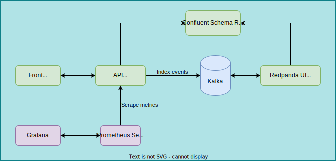

# rgb-system

## What is rgb-system ?

This is a full stack application, from a frontend consisting of 3 buttons generating "events" (red, blue, green) to a big data OLAP system.

### Stack schema



## How to build application 🛠️

The only thing you will need should be **Docker** 🐋

```bash
# To build all the backend:
docker-compose up -d --build

# To build all the app including front-end:
docker-compose --profile=all up -d --build
```

## Useful links 💡

- [Kafka - Topics](http://localhost:9000/topics)
- [Kafka - Schema Registry](http://localhost:9000/schema-registry)
- [API - OpenAPI](http://localhost:8000/)
- [API - Available metrics](http://localhost:8000/metrics)
- [Prometheus - Server UI](http://localhost:9090/)
- [Grafana - Dashboards](http://localhost:3000/dashboards)
- [Front - Home](http://localhost:8080/) require front to be running (local or docker)

## Time to clean up ? 🧽

```bash
docker-compose --profile=all down -v --rmi all
```
